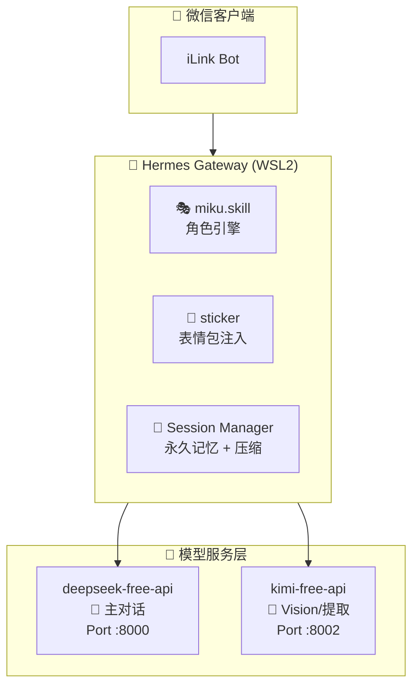

# Miku Hermes Chat - 初音未来虚拟角色情感聊天系统

[](https://github.com/NousResearch/hermes-agent)
[](LICENSE)
[]()
[]()

基于 [Hermes Agent](https://github.com/NousResearch/hermes-agent) 框架构建的**初音未来（Hatsune Miku）虚拟角色情感聊天系统**。通过开源 Free API 反代技术实现零 API 费用的多模态 AI 女友体验，支持微信端实时对话、图片理解、长期记忆、上下文压缩及表情包生成。

## ✨ 核心特性

| 功能            | 状态     | 说明                                  |
| ------------- | ------ | ----------------------------------- |
| 💬 角色扮演聊天     | ✅ 完成   | 基于 miku.skill 的初音未来女友人格             |
| 🖼️ 图片识别      | ✅ 完成   | 发送图片自动描述，支持多模态理解                    |
| 🧠 长期记忆       | ✅ 完成   | 会话永不自动重置，跨天记忆                       |
| 📦 上下文压缩      | ✅ 完成   | 自动压缩超长对话历史                          |
| 📝 标题自动生成     | ✅ 完成   | 会话自动命名                              |
| 🌐 网页内容提取     | ✅ 完成   | URL 发送即解析                           |
| 🎨 表情包注入     | ✅ 完成   | 情感检测 + 关键词匹配，自动插入初音表情包           |
|  Token 自动刷新 | ✅ 完成   | Windows 任务计划程序定时刷新                  |
| ⚡ 24×7 保活     | ✅ 完成   | 关屏不关机，持续在线                          |
| 🎤 TTS 语音合成     | 🔌 可选   | Edge TTS 免费 / 网站反代 / RVC 本地 / AI 模型 |

## 🏗️ 架构概览



---

## 🚀 快速开始

### 前置条件

- Windows 10/11 + WSL2 (Ubuntu 24.04)
- [Hermes Agent](https://github.com/NousResearch/hermes-agent) 已安装
- Python 3.12+, Node.js 18+

### 1. 部署免费 API 反代

```bash
# deepseek-free-api (主对话)
git clone https://github.com/LLM-Red-Team/deepseek-free-api.git
cd deepseek-free-api && pip install -r requirements.txt
uvicorn main:app --host 0.0.0.0 --port 8000

# kimi-free-api (辅助模型 - 需 token)
git clone https://github.com/HuangJHong/kimi-free-api.git
cd kimi-free-api && npm install && npm start  # Port 8002
```

### 2. 安装 Miku Skill

```bash
cp -r miku.skill/ $HERMES_HOME/skills/miku/
```

### 3. 配置 Hermes

详细步骤见 [docs/部署指南.md](docs/部署指南.md)，核心配置如下：

```bash
# 1. 复制配置模板
cp config-example/config.yaml.example ~/.hermes/config.yaml

# 2. 设置环境变量
cat >> ~/.hermes/.env << 'EOF'
DEEPSEEK_API_KEY=sk-your-deepseek-key
HERMES_MAX_ITERATIONS=90
DEEPSEEK_MODEL=deepseek-chat
WEIXIN_DM_POLICY=open
EOF

# 3. 安装 Miku 角色技能
mkdir -p ~/.hermes/skills/miku
cp -r miku.skill/SKILL.md ~/.hermes/skills/miku/
cp -r miku.skill/pictures/ ~/.hermes/skills/miku/pictures/

# 4. 启用技能
hermes skills enable miku
```

> 📚 **完整配置参考：** 更多详细配置（语音模式、TTS、辅助功能等）见：
> - [docs/PROJECT_OVERVIEW.md](docs/PROJECT_OVERVIEW.md) — 完整配置结构
> - [docs/部署指南.md](docs/部署指南.md) — 手把手部署教程
> - [docs/操作指令参考.md](docs/操作指令参考.md) — 聊天指令大全

### 4. 安装表情包功能

将初音未来表情包注入引擎放入 Hermes 网关扩展目录：

```bash
# 复制表情包注入引擎
cp gateway/sticker_injector.py $HERMES_HOME/gateway/sticker_injector.py
cp gateway/sticker_cache.py $HERMES_HOME/gateway/sticker_cache.py

# 表情包图片已在步骤 3 的 miku.skill/pictures/ 中安装
# 重启网关后，miku 会自动根据情绪发送匹配的表情包
```

> `sticker_injector.py` 支持 6 种情绪检测（开心/难过/害羞/生气/惊讶/日常）+ 关键词匹配 + 时段感知，从 209 张初音表情包中自动选择最合适的。

### 5. 启动 Hermes → 连接微信

```bash
# 进入 WSL
wsl.exe -d Ubuntu-24.04

# 首次需配置微信（扫码登录）
hermes gateway setup
# 选择 Weixin → 等待二维码 → 手机微信扫码 → 确认登录

# 启动微信网关
hermes gateway start

# 检查状态
hermes gateway status
```

测试：用手机微信给 Bot 发 `miku`，初音未来就会回复你！♡

### 6. 配置 TTS 语音（可选）

编辑 `~/.hermes/config.yaml`，选择一种 TTS 方案：

```yaml
tts:
  provider: edge           # 免费 Edge TTS
  edge:
    voice: zh-CN-XiaoxiaoNeural
  # 或使用 aivoicelab 初音未来角色语音（网站反代，需自行部署）
  # provider: aivoicelab
  # aivoicelab:
  #   model: miku
  #   model_name: us-female-hatsune-miku
```

重启网关后语音生效。详见 [gateway/tts_interface.py](gateway/tts_interface.py) 和 [docs/操作指令参考.md](docs/操作指令参考.md)。

### 7. 配置辅助功能

标题自动生成和网页内容提取走 kimi-free-api (Port 8002)，在 `~/.hermes/config.yaml` 中配置：

```yaml
auxiliary:
  title_generation:
    model: kimi-latest
    base_url: http://127.0.0.1:8002/v1
    api_key: your-kimi-token      # 与 kimi-free-api 共用 token
  web_extract:
    model: kimi-latest
    base_url: http://127.0.0.1:8002/v1
    api_key: your-kimi-token
    timeout: 360                  # 网页提取耗时较长，给足够超时
```

> **标题自动生成**：新会话的第一轮对话后，自动用 Kimi 摘要生成中文标题。  
> **网页内容提取**：在微信中发送 URL（如 B站视频、知乎文章），miku 会自动抓取内容并分析。

## 📁 项目结构

```
miku-hermes-chat/
├── README.md                       # 本文件
├── LICENSE                         # Apache 2.0
├── miku.skill/                     # 初音未来角色定义
│   ├── SKILL.md                    #    人格、对话规则、示例
│   └── pictures/                   #    表情包图片 + sticker_catalog.json
├── gateway/                        # Hermes 网关扩展
│   ├── sticker_injector.py         #    情感表情包注入引擎
│   ├── sticker_cache.py            #    表情包描述缓存
│   └── tts_interface.py            #    TTS 语音合成接口定义
├── config-example/                 # 配置模板（已脱敏）
│   └── config.yaml.example         #    含 TTS 可选方案注释
├── scripts/                        # 运维脚本
│   ├── start-all-services.sh       #   全服务启动 (WSL2)
│   ├── restart-gateway.sh          #   网关重启
│   ├── 启动Miku网关.bat            #   一键重启 (Windows)
│   ├── keep-awake.py               #   系统保活
│   ├── 睡眠保活模式.bat            #   保活启动
│   ├── refresh-kimi-token.py       #   Kimi Token 自动刷新
│   ├── refresh-kimi-token.ps1      #   Windows 任务计划
│   └── refresh-kimi-token.bat      #   刷新批处理
└── docs/                           # 文档
    ├── PROJECT_OVERVIEW.md          #   项目总览（架构、配置、命令）
    ├── free-api-guide.md           #   免费 API 部署详解
    ├── architecture.md             #   系统架构说明
    ├── 部署指南.md                  #   从零部署教程
    └── 操作指令参考.md               #   全部聊天指令 + 排查命令
```

## 🔑 免费 API 说明

本项目完全基于**免费 API 反代**技术，实现零 API 费用：

| 服务                | 上游           | 端口   | 说明                |
| ----------------- | ------------ | ---- | ----------------- |
| deepseek-free-api | DeepSeek 网页版 | 8000 | 主对话，OpenAI 兼容 |
| kimi-free-api     | Kimi 网页版     | 8002 | 辅助模型群（Vision/压缩/提取） |

详细部署指南见 [docs/free-api-guide.md](docs/free-api-guide.md)。

## 🎤 语音指令

在聊天中发送以下指令控制 TTS 语音行为：

| 指令 | 效果 |
|------|------|
| `/voice tts` | 所有回复都带语音（默认） |
| `/voice on` | 仅回复语音消息时发语音 |
| `/voice off` | 纯文字，不发语音 |
| `/voice status` | 查看当前语音模式 |
| `/voiceorder after` | 语音在文字+表情包之后发 |
| `/voiceorder before` | 语音在文字+表情包之前发 |

语音支持三种模式：**全量 TTS** → 所有回复带语音 / **语音回复** → 仅在收到语音时回复语音 / **关闭** → 纯文字静音。详细文档见 [docs/操作指令参考.md](docs/操作指令参考.md)。

## 🎭 Role Character

本项目使用了初音未来（Hatsune Miku）作为虚拟角色原型：

- **官方设定**: Crypton Future Media
- **形象设计**: KEI
- **音源提供**: 藤田咲
- **代表作品**: 甩葱歌、Tell Your World、世界第一的公主殿下

角色 Skill 文件基于官方设定与同人文化创作，用于虚拟女友角色扮演体验。

## ⚖️ 角色版权与使用协议

本项目使用的**初音未来 (Hatsune Miku)** 虚拟角色受以下协议保护：

| 协议 | 适用对象 | 许可范围 |
|------|----------|----------|
| [PCL](https://piapro.jp/license/pcl/summary) (Piapro Character License) | 初音未来等 Crypton 角色 | 非营利二次创作、公开展示、分发 |
| [CC BY-NC 3.0](https://creativecommons.org/licenses/by-nc/3.0/) | 角色原始插画 | 复制、改编、分发（非商业用途） |

**使用要求：**
- **非商业** — 禁止营利目的、禁止广告宣传、禁止收费
- **署名** — 必须标注 `Hatsune Miku, © Crypton Future Media, Inc. 2007`
- **CC 链接** — 在线发布时添加 `licensed under a CC BY-NC: https://creativecommons.org/licenses/by-nc/3.0/`
- **商业用途** — 需联系 intlbiz@crypton.co.jp 获取单独授权

**本项目遵守：** 本项目为个人非营利研究交流，角色 Skill 基于官方设定与同人文化创作，所有角色版权归 [Crypton Future Media, Inc.](https://www.crypton.co.jp/) 所有。

详细使用条款: https://piapro.jp/license/character_guideline

## 📄 License

Apache 2.0 - 详见 [LICENSE](LICENSE)

\####免责声明
逆向API是不稳定的，建议前往MoonshotAI官方 <https://platform.moonshot.cn/> 付费使用API，避免封禁的风险。

本组织和个人不接受任何资金捐助和交易，此项目是纯粹研究交流学习性质！

仅限自用，禁止对外提供服务或商用，避免对官方造成服务压力，否则风险自担！

仅限自用，禁止对外提供服务或商用，避免对官方造成服务压力，否则风险自担！

仅限自用，禁止对外提供服务或商用，避免对官方造成服务压力，否则风险自担！

## 🙏 致谢

- [Nous Research](https://github.com/NousResearch) - Hermes Agent 框架
- [LLM-Red-Team](https://github.com/LLM-Red-Team) - deepseek-free-api
- [HuangJHong](https://github.com/HuangJHong) - kimi-free-api (Vision 修复)
- [lzA6](https://github.com/lzA6) - arting-2api 参考
- [Crypton Future Media](https://www.crypton.co.jp/) - 初音未来角色版权方
- [KEI](https://x.com/kei_garou) - 初音未来角色原画设计
- [藤田咲](https://x.com/fujitasaki_pu) - 初音未来音源提供 

